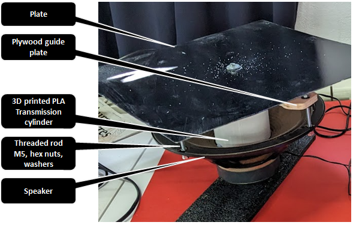
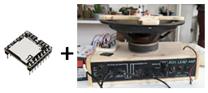
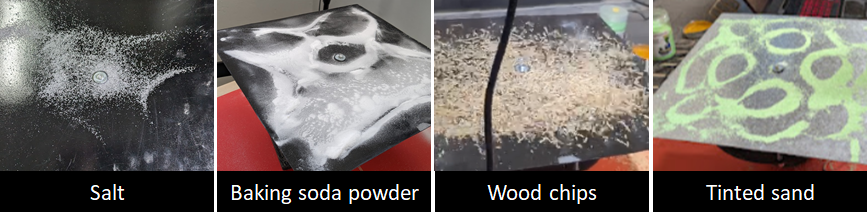
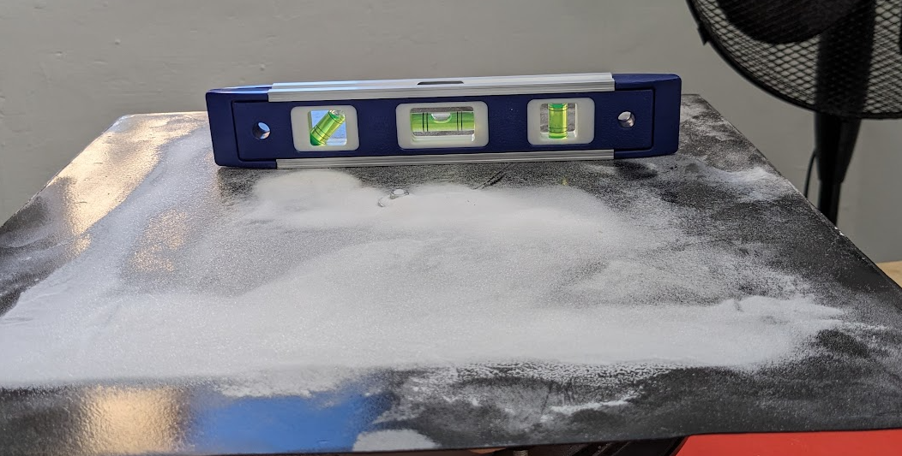

#    Nature patterns: Secret Languages II
*By [Anthuanet Falcon](https://anthuanetf.github.io/MDEF/) & [Albert Vila](https://avilabon.github.io/MDEF_Albert/)* :)

# Microchallenge 2: Dr. Chladni

## 1. Introduction 

This microchallenge is an improvement and evolution of [microchallenge 1](https://github.com/AnthuanetF/Micro-Challenge-MDEF24/blob/main/Microchallenge1.md). 

## 2. Our proposal for microchallenge 2

The aim of this microchallenge is to go one step further than Microchallenge 1 by incorporating artificial intelligence into the frequency-pattern system with (machine learning) and also a first exploration of new inputs such as the frequencies or rhythms of the human body such as the heart rate. 

The microchallenge 2 has two different parts, the first part is closing the loop between frequencies and patterns by training a recognition system with AI that is capable of given a pattern, assigning it a frequency.

The second part consists of creating a sensor capable of counting heart rate and, through a mapping of values between a reference table of health states by heart rate, assigning it a frequency and analogically building a visual pattern like a new form of diagnosis.

To be able to carry out everything planned for this challenge, the first step was to fix the Chladni Plate to improve performance. Thanks to previous experience and especially past mistakes, we have completely rebuilt the Chladni Plate but this time much faster.

### Planning

## 3. The Chladni plate 2.0

## 3.1. The plate parts

- Speaker: 30 watts 4 ohms from an old AXTECH electric guitar amplifier
- Transmission cylinder printed in PLA 3D
- M5 threaded rods, hexagonal nuts and washers for fixing the plywood guide.
- Threaded rod guide, hexagonal nuts, O-rings and washers to fix the transmission cylinder with the plate.
- The plate (aluminum or galvanized steel)

## 3.2. The electronic parts

## 4. Training a model using a Chladni plate patterns

To train a model we used a webcam connected to a https://teachablemachine.withgoogle.com/models/1Ci8Ej72D/

We recorded various images for each frequency tested, with different metal plates, materials and lighting conditions. Later we clean and unify the classes. Leaving 9 classes within the optimal operating range of the metal plate.

Zenithal webcam assembly for training the frequency recognizer from patterns:

The results:

## 5. Tools and materials:

### Software:
- Rhino
- Ultimaker Cura
- Adobe Illustrator
- Trotec sw
- Audacity
- NCH Tone Generator (free trial)
- Notion
- Github
- The teacheable machine

### Digital fabrication machines:

| Name | Use |
| --- | --- |
| 3D printer Creality Ender-3 PRO | Transmission cylinder and  Dr. Chladni electronics box |
| Raptor Milling machine | Plywood transmission guide |

### Power and hand tools:
| Name | Use |
| --- | --- |
| Column drill and bits | Make holes in metal plates |
| Miter machine | Plywood cutting |
| Angle grinder | Polish metal burrs |
| Soft solder |  |
| Files, rasp, sanding paper | Wires |
| Wrench | Ensamble chladni plate |

### Hardware:
- Webcam
- Personal computers
- Cell phones

## 6. Iteration process

We did several iterations of practically everything.

For the structural and electronic elements of the plate we renewed several times all the elements that made up the system. From the speakers to the transmission parts and even the sound amplification system had been improved several times.

#### Amplification system:

| Iteration 1 | Iteration 2 | Iteration 3
| --- | --- | ---|
|  |  |  | 
| DF Player Mini | DF Player Mini with an old guitar ampr | DF Player Mini and a digital amp board XH-M577 TPA3116D2 80x2W |
| The DF player does not have enough power for our 30 watt speaker | The amp is very old and has all the potentiometers that fail and need to be repaired so the sound is scratchy and intermittent | The digital amp board gives us good performance |
|  |  | |

#### Plate material:

At the level of materials, we test metal plates made of galvanized steel and aluminum of different sizes and thicknesses. Although for lower power systems it seems that the aluminum plates worked better, for our system the 32 x 32 cm galvanized steel plate was the one that gave us the best results.

#### Pattern material: 

We also try different materials for drawing the pattern. The materials tested were: salt, baking soda powder, wood chips and fine sand painted green for decorative use. The material that worked best by far was fine sand. the

#### Input frequencies:

Regarding the frequencies, we also carried out different tests to validate the optimal working range and vibration transmission of our system. For the final galvanized steel and sand plate configuration, the optimal ranges for pattern drawing were approximately 50 to 1500 Hz. It is observed that at certain low frequencies the system enters resonance and is unable to define the patterns well and quickly expels the materials out of the plate.

#### Others:

Other factors that were taken into account were the intensity of the sound (db) and the waiting time for the pattern to be drawn. Due to time constraints, the data regarding these aspects was not taken, but after various tests we defined the modus operandi starting at low volumes and gains for each frequency change and with a progressive increase without reaching very high plate resonance levels and leaving operate the system between 20 and 40 seconds.

We soon discovered that for optimal operation it is very important to always have the plate well leveled.

## 7. Diagnosis by patterns, practical application case.

## 8. Conclusions and new ideas

1. This is just the beginning​!
2. It is important not to have abandoned the project despite the results of the first microchallenge since the experience has provided us with a functional redesign in a very short time.
3. The AI model, although simple, opens the doors for us to see how certain formations that we find in nature at various levels from macro to micro correspond more or less to certain frequencies.
4. The mix between the variables of the human body and pattern diagnosis systems is a new field to explore that has been very well received. 

## 9. References

- [How to control your DFMini Player MP3 module with Arduino](https://www.dfrobot.com/blog-1462.html)

- [Run Teacheable Machine model in an microcontroller](https://github.com/googlecreativelab/teachablemachine-community/blob/master/snippets/markdown/tiny_image/GettingStarted.md)

- [Teacheable machine](https://teachablemachine.withgoogle.com/)

### Thanks to microchallenge supporting team and to the classemates!!!!!!!!!!

