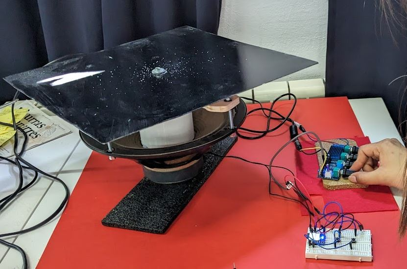
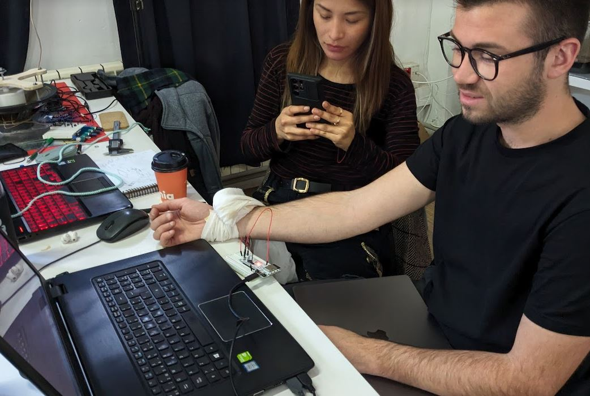

#    Nature patterns: Secret Languages II
*By [Anthuanet Falcon](https://anthuanetf.github.io/MDEF/) & [Albert Vila](https://avilabon.github.io/MDEF_Albert/)* :)

# Microchallenge 2: Dr. Chladni


## 1. Introduction 


This microchallenge is an improvement and evolution of [microchallenge 1](https://github.com/AnthuanetF/Micro-Challenge-MDEF24/blob/main/Microchallenge1.md). 


## 2. Our proposal for microchallenge 2

The aim of this microchallenge is to go one step further than Microchallenge 1 by incorporating artificial intelligence into the frequency-pattern system with (machine learning) and also a first exploration of new inputs such as the frequencies or rhythms of the human body such as the heart rate. 

The microchallenge 2 has two different parts, the first part is closing the loop between frequencies and patterns by training a recognition system with AI that is capable of given a pattern, assigning it a frequency.


The second part consists of creating a sensor capable of counting heart rate and, through a mapping of values between a reference table of health states by heart rate, assigning it a frequency and analogically building a visual pattern like a new form of diagnosis.


To be able to carry out everything planned for this challenge, the first step was to fix the Chladni Plate to improve performance. Thanks to previous experience and especially past mistakes, we have completely rebuilt the Chladni Plate but this time much faster.

### Planning


## 3. Dr. Chladni

We call Dr. Chladni to the system composed of the Chladni Plate itself, the piezo sensor for estimating heart rate and all the electronics used to control the entire system.

## 3.1. The Chladni plate 2.0 (parts)


- Speaker: 30 watts 4 ohms from an old AXTECH electric guitar amplifier
- Transmission cylinder printed in PLA 3D
- M5 threaded rods, hexagonal nuts and washers for fixing the plywood guide.
- Plywood transmission guide.
[Download dxf file](recursosMicrochallenge2/documents/PlywoodTransmissionGuide.dxf)
- Threaded rod guide, hexagonal nuts, O-rings and washers to fix the transmission cylinder with the plate.
- The plate (aluminum or galvanized steel)


## 3.2. The piezo sensor

The support team challenged us to build a heart rate sensor from a piezo so we tried that. It should be said that it works more or less since it is very sensitive.

| The piezo | Operation | Theory|
| --- | --- | --- |
|  |  |A piezoelectric sensor is a device that uses the piezoelectric effect to measure changes in pressure, acceleration, temperature, strain, or force by converting them to an electrical charge... [Learn more](https://en.wikipedia.org/wiki/Piezoelectric_sensor)|




## 3.3. The controlling box and code

This 3d printed box contains all the electronic parts used to control of the system.


[Download stl 3D model of the box](recursosMicrochallenge2/documents/PIEZA%20MAYOR_1ANT_ALBERT.stl)

### Inside the box:


### The code

This is the code to count the beats of the piezoelectric sensor for 15 seconds, obtain the value of beats per minute and launch a track to the mp3 player that is connected to the amplifier which in turn is connected to the Chladni plate. The ranges of beats per minute values are mapped to specific frequency values to give a diagnosis of health status by pattern.

This code is the union of two codes that worked well separately but contains some errors resulting from the union and would have to be debugged.


```
//Define DFPlayer libraries
#include "Arduino.h"
#include <DFRobotDFPlayerMini.h>
#include <SoftwareSerial.h>

// Create a SoftwareSerial object to communicate with the DFPlayer Mini
SoftwareSerial mySerial(10, 11);  // RX, TX

// Create a DFRobotDFPlayerMini object to control the DFPlayer Mini
DFRobotDFPlayerMini myDFPlayer;

// Define variables for the piezo sensor
const int knockSensor = 1;

// threshold value to decide when the detected sound is a knock or not
const int threshold = 100; 

// Reset beat and beats per minute variables
int beat = 0;
int ppm = 0;

// To start count 15seconds 15000 milliseconds
int startMillis;
int currentMillis;
const int period = 15000;

// these variables will change:
int sensorReading = 0;  // variable to store the value read from the sensor pin

void setup() {
  //Serial.begin(9600);      // use the serial port
  startMillis = millis();  //initial start time

  // Initialize the DFPlayer Mini object
  if (!myDFPlayer.begin(mySerial)) {
    Serial.println(F("Unable to begin:"));
    Serial.println(F("1.Please recheck the connection!"));
    Serial.println(F("2.Please insert the SD card!"));
    while (true)
      ;
  } else {
    Serial.println(F("DFPlayer Mini online."));
  }

  // Set the volume (0 to 30)
  myDFPlayer.volume(25);

  // Play track 001 from the SD card
  // myDFPlayer.play(1);
}


void loop() {

  currentMillis = millis();
  int timeElapsed = abs(currentMillis - startMillis);

  if (timeElapsed <= period) {
    // read the sensor and store it in the variable sensorReading:
    sensorReading = analogRead(knockSensor);

    // if the sensor reading is greater than the threshold:
    if (sensorReading >= threshold) {
      // send the string "Knock!" back to the computer, followed by newline
      beat = beat + 1;
      Serial.print("Total beat: ");
      delay(100);
      Serial.println(beat);
    }
    Serial.println(timeElapsed);
    delay(100);  // delay to avoid overloading the serial port buffer}
  } else {
    ppm = beat * 4; // multiply per 4 to obtain beats per minute
    Serial.print("Pulsaciones por minuto: ");
    Serial.println(ppm);

// Depending on ppm value, launch a track to activate the mp3 player

    if (ppm < 60) {
      myDFPlayer.play(1); // k = (100.mp3);
    } else if ((ppm >= 60) && (ppm < 64)) {
      myDFPlayer.play(2);  // = (200.mp3);
    } else if ((ppm >= 64) && (ppm < 70)) {
      myDFPlayer.play(3);  // =(350.mp3);
    } else if ((ppm >= 70) && (ppm < 74)) {
      myDFPlayer.play(4);  // = (430.mp3);
    } else if ((ppm >= 74) && (ppm < 79)) {
      myDFPlayer.play(5);  //= (460.mp3);
    } else if ((ppm >= 79) && (ppm < 85)) {
      myDFPlayer.play(6);  // = (490.mp3);
    } else if ((ppm >= 85) && (ppm < 91)) {
      myDFPlayer.play(7); //= (800.mp3);
    } else if ((ppm >= 91) && (ppm < 100)) {
      myDFPlayer.play(8); //= (1000.mp3);
    } else if (ppm >= 100) {
      myDFPlayer.play(9); //= (1300.mp3);
    } else {
      Serial.println("There is an error! Reset the system!");
      //delay(150);
    }
  }
  //Serial.println("Reset me to go again!");
}
```

## 4. Training a model using a Chladni plate patterns

To train a model we used a webcam connected to a https://teachablemachine.withgoogle.com


We recorded various images for each frequency tested, with different metal plates, materials and lighting conditions. Later we clean and unify the classes. Leaving 9 classes within the optimal operating range of the metal plate.

Zenithal webcam assembly for training the frequency recognizer from patterns:


### The results

A a result we defined 9 classes of frequencies:


Afterwards we tested the model against other natural patterns to see how well it matched, but we didn't have time to explore that much.


[Test our model with your patterns](https://teachablemachine.withgoogle.com/models/1Ci8Ej72D/)

## 5. Diagnosis by patterns, practical application case.


The mapping between frequencies-patterns and heart rates.


The first victim during the presentation:


Dr. Chladni at Design Dialogs 2:


## 6. Tools and materials:

### Software:
- Rhino
- Ultimaker Cura
- Adobe Illustrator
- Trotec sw
- Audacity
- NCH Tone Generator (free trial)
- Notion
- Github
- The teacheable machine

### Digital fabrication machines:

| Name | Use |
| --- | --- |
| 3D printer Creality Ender-3 PRO | Transmission cylinder and  Dr. Chladni electronics box |
| Raptor Milling machine | Plywood transmission guide |

### Power and hand tools:
| Name | Use |
| --- | --- |
| Column drill and bits | Make holes in metal plates |
| Miter machine | Plywood cutting |
| Angle grinder | Polish metal burrs |
| Soft solder |  |
| Files, rasp, sanding paper | Wires |
| Wrench | Ensamble chladni plate |

### Hardware:
- Webcam
- Personal computers
- Cell phones

## 7. Iteration process

We did several iterations of practically everything.

For the structural and electronic elements of the plate we renewed several times all the elements that made up the system. From the speakers to the transmission parts and even the sound amplification system had been improved several times.

#### Amplification system

| Iteration 1 | Iteration 2 | Iteration 3
| --- | --- | ---|
|  |  |  | 
| DF Player Mini | DF Player Mini with an old guitar ampr | DF Player Mini and a digital amp board XH-M577 TPA3116D2 80x2W |
| The DF player does not have enough power for our 30 watt speaker | The amp is very old and has all the potentiometers that fail and need to be repaired so the sound is scratchy and intermittent | The digital amp board gives us good performance |

#### Plate material

At the level of materials, we test metal plates made of galvanized steel and aluminum of different sizes and thicknesses. Although for lower power systems it seems that the aluminum plates worked better, for our system the 32 x 32 cm galvanized steel plate was the one that gave us the best results.

#### Pattern material

We also try different materials for drawing the pattern. The materials tested were: salt, baking soda powder, wood chips and fine sand painted green for decorative use. The material that worked best by far was fine sand. the


#### Input frequencies

Regarding the frequencies, we also carried out different tests to validate the optimal working range and vibration transmission of our system. For the final galvanized steel and sand plate configuration, the optimal ranges for pattern drawing were approximately 50 to 1500 Hz. It is observed that at certain low frequencies the system enters resonance and is unable to define the patterns well and quickly expels the materials out of the plate.

#### Others

Other factors that were taken into account were the intensity of the sound (db) and the waiting time for the pattern to be drawn. Due to time constraints, the data regarding these aspects was not taken, but after various tests we defined the modus operandi starting at low volumes and gains for each frequency change and with a progressive increase without reaching very high plate resonance levels and leaving operate the system between 20 and 40 seconds.

We soon discovered that for optimal operation it is very important to always have the plate well leveled.


## 8. Conclusions and new ideas

1. This is just the beginning​!
2. It is important not to have abandoned the project despite the results of the first microchallenge since the experience has provided us with a functional redesign in a very short time.
3. The AI model, although simple, opens the doors for us to see how certain formations that we find in nature at various levels from macro to micro correspond more or less to certain frequencies.
4. The mix between the variables of the human body and pattern diagnosis systems is a new field to explore that has been very well received. 


## 9. References and inspirations

- [A simple and inexpensive optical technique to help students visualize mode shapes](https://www.researchgate.net/figure/Chladni-pattern-of-the-square-plate-shown-in-Fig-2-oscillating-at-the-same-frequency_fig1_221712242)

- [Barduino pinout](https://fablabbcn-projects.gitlab.io/electronics/barduino-docs/GettingStarted/pinout/)

- [Detect a knock with Arduino code](https://docs.arduino.cc/built-in-examples/sensors/Knock/)

- [How to control your DFMini Player MP3 module with Arduino](https://www.dfrobot.com/blog-1462.html)

- [How to use the DFMini Player MP3 Module with Arduino](https://www.dfrobot.com/blog-1462.html)

- [Knock detection with a piezo sensor](https://youtu.be/1SNC3ib10_4?feature=shared)

- [Machine learning articles](https://github.com/christianversloot/machine-learning-articles/blob/main/using-teachable-machine-for-creating-tensorflow-models.md)

- [Modal analysis of plate to analyze the effect of mass stiffeners using the Chladni plate approach](https://www.sciencedirect.com/science/article/abs/pii/S2214785322061223)

- [Modulo DFplayer mini Reproductor mp3 para arduino, tutorial completo](https://www.electroallweb.com/index.php/2020/07/22/modulo-dfplayer-mini-reproductor-mp3-tutorial-completo/amp/)

- [Online tone generator](https://www.szynalski.com/tone-generator/)

- [Point-driven modern Chladni figures with symmetry breaking](https://www.nature.com/articles/s41598-018-29244-6)


- [Run Teacheable Machine model in an microcontroller](https://github.com/googlecreativelab/teachablemachine-community/blob/master/snippets/markdown/tiny_image/GettingStarted.md)

- [Teacheable machine](https://teachablemachine.withgoogle.com/)

- [Tracing our digital actions through modern scribes](https://www.domesticstreamers.com/art-research/work/tracing-our-digital-actions-through-modern-scribes/)

- [Using millis() for timing. A beginners guide](https://forum.arduino.cc/t/using-millis-for-timing-a-beginners-guide/483573)

## Thanks to microchallenge supporting team and to the classmates!!!!!!!!!!


