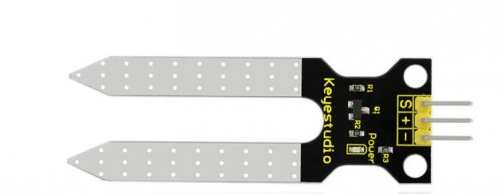

#    Nature patterns: Secret Languages III
*By [Anthuanet Falcon](https://anthuanetf.github.io/MDEF/) & [Albert Vila](https://avilabon.github.io/MDEF_Albert/)* :)

# Microchallenge 3: Planta Vibras
Planta Vibras aims to create a decentralized sensory immersive experience through a day in the life of a plant.


## 1. Introduction 
Planta Vibras is an interactive installation that explores the decentralized sensory communication of plants and their ability to influence other bodies, including the human body. Inspired by the intelligent systems of plants, our project seeks to demonstrate how sensory data travels through your body, strengthening your sensory system and allowing you to interact with your environment through your 'Body Data'.
In contrast to human sensory perception, which has been centralized in the head and has neglected the crucial role of the skin, Planta Vibras proposes an interactive intervention that fuses the 'Body Data' of the Calatea plant with the consciousness of the human body in the It was Anthropocene.


We collect humidity, light and conductivity data from the plant environment for 24 hours, supplemented by photographs every 30 seconds. This information is synthesized into a one-minute immersive experience, an speculative simulation of the differnt "processes" of the plant during a day. Using a piece of electronics developed by us and connected to the body at specific points, mini motors simulate the internal path of the plant, vibrating at points of movement and internal activity.
Planta Vibras aims to raise awareness about non-human intelligences and promote new languages ​​of interconnection that allow us to empower ourselves in a post-anthropocene perspective, collaborating with all species.

## 2. Project structure and flow

The initial goal proposed by the faculty for this microchallenge was:

**Compose a meaningful interaction that uses data collected from an “INPUT” (body) and transforms it into another digital signal (OUPUT).**

Our proposal uses a plant and its immediate environment as **body** and collects data from multiple sensors (soil moisture, temperature, light and image) as **INPUTS**. After a day, this data is processed together creating diferent categories of plant activity. These categories of activity are used to create different vibration flows of 6 small vibrating motors (**OUTPUT**) strategically located in a "human body" that receives these vibrations during 2 minutes (**INTERACTION**). To achieve a decentralized sensory experience, the vibrating motors are distributed throughout the body away from the brain. During these two minutes and to reduce the influence of sight or the senses close to the brain, a time-lapse video with different recording planes of the plant is projected with VR glasses.


### Planning


## 3. The inputs

### 3.1. The soil humidity

The Keystudio Moisture Sensor


[Key Studio Moisture Sensor Datasheet](https://wiki.keyestudio.com/Ks0049_keyestudio_Soil_Humidity_Sensor
)[Key Studio Moisture Sensor Datasheet](https://wiki.keyestudio.com/Ks0049_keyestudio_Soil_Humidity_Sensor
)

Basic connection


```
    /*
    # Example code for the moisture sensor
    # Connect the sensor to the A0(Analog 0) pin on the Arduino board
    # the sensor value description
    # 0  ~300     dry soil
    # 300~700     humid soil
    # 700~950     in water

    */
    void setup(){
    
    Serial.begin(57600);
    } 
    void loop(){
    Serial.print("Moisture Sensor Value:");
    Serial.println(analogRead(0)); 
    delay(100);
    }
```

## 4. The processing

## 5. The outputs


## 6. Tools and materials:

### Software:
- Rhino
- Ultimaker Cura
- Adobe Illustrator
- Trotec sw
- Audacity
- NCH Tone Generator (free trial)
- Notion
- Github
- The teacheable machine

### Digital fabrication machines:

| Name | Use |
| --- | --- |
| 3D printer Creality Ender-3 PRO | Transmission cylinder and  Dr. Chladni electronics box |
| Raptor Milling machine | Plywood transmission guide |

### Power and hand tools:
| Name | Use |
| --- | --- |
| Column drill and bits | Make holes in metal plates |
| Miter machine | Plywood cutting |
| Angle grinder | Polish metal burrs |
| Soft solder |  |
| Files, rasp, sanding paper | Wires |
| Wrench | Ensamble chladni plate |

### Hardware:
- Webcam
- Personal computers
- Cell phones

## 7. Iteration process


## 8. Conclusions and new ideas

1. 
2. 


## 9. References and inspirations

- [NDVI with a conventional camera](https://www.unex.es/organizacion/servicios-universitarios/servicios/comunicacion/archivo/2021/mayo-de-2021/3-de-mayo-de-2021/una-tecnica-desarrollada-en-la-uex-permite-medir-la-actividad-fotosintetica-de-las-plantas-utilizando-una-camara-fotografica-convencional)

- [Key Studio Moisture Sensor Datasheet](https://wiki.keyestudio.com/Ks0049_keyestudio_Soil_Humidity_Sensor
)
## Thanks to microchallenge supporting team and to the classmates!!!!!!!!!!


