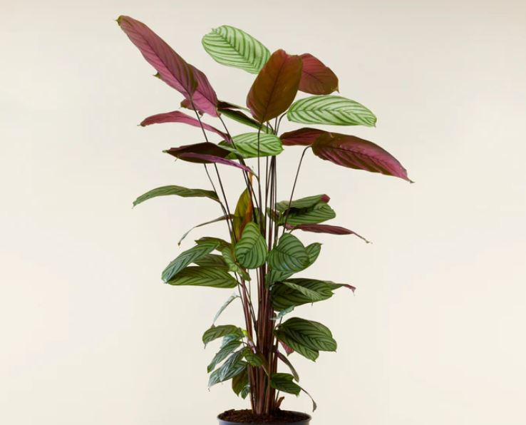

#    Nature patterns: Secret Languages III
*By [Anthuanet Falcon](https://anthuanetf.github.io/MDEF/) & [Albert Vila](https://avilabon.github.io/MDEF_Albert/)* :)

# Microchallenge 3: Planta Vibras
Planta Vibras aims to create a decentralized sensory immersive experience through a day in the life of a plant.


## 1. Introduction 
Planta Vibras is an interactive installation that explores the decentralized sensory communication of plants and their ability to influence other bodies, including the human body. Inspired by the intelligent systems of plants, our project seeks to demonstrate how sensory data travels through your body, strengthening your sensory system and allowing you to interact with your environment through your 'Body Data'.
In contrast to human sensory perception, which has been centralized in the head and has neglected the crucial role of the skin, Planta Vibras proposes an interactive intervention that fuses the 'Body Data' of the Calatea plant with the consciousness of the human body in the It was Anthropocene.


We collect humidity, light and conductivity data from the plant environment for 24 hours, supplemented by photographs every 30 seconds. This information is synthesized into a one-minute immersive experience, an speculative simulation of the differnt "processes" of the plant during a day. Using a piece of electronics developed by us and connected to the body at specific points, mini motors simulate the internal path of the plant, vibrating at points of movement and internal activity.
Planta Vibras aims to raise awareness about non-human intelligences and promote new languages ​​of interconnection that allow us to empower ourselves in a post-anthropocene perspective, collaborating with all species.

## 2. Project structure and flow

The initial goal proposed by the faculty for this microchallenge was:

**Compose a meaningful interaction that uses data collected from an “INPUT” (body) and transforms it into another digital signal (OUPUT).**


Our proposal uses a plant and its immediate environment as **body** and collects data from multiple sensors (soil moisture, temperature, light and image) as **INPUTS**. After a day, this data is processed together creating diferent categories of plant activity. These categories of activity are used to create different vibration flows of 6 small vibrating motors (**OUTPUT**) strategically located in a "human body" that receives these vibrations during 2 minutes (**INTERACTION**). To achieve a decentralized sensory experience, the vibrating motors are distributed throughout the body away from the brain. During these two minutes and to reduce the influence of sight or the senses close to the brain, a time-lapse video with different recording planes of the plant is projected with VR glasses.


Initially, we planned the general diagram of systems and information flow of the artifact to adapt to the following scheme. In the end, due to a lack of time, the transfer of the information request from the exit system to the Max8, via WiFi, remained pending programming. Currently, the operating sequence of the 6 output motors based on the plant data is included in the board program.


### Planning

The planning was adjusted each day based on the achievements and failures of the previous days.


## 3. The inputs




The plant chosen was Calathea because an interesting detail about Calatheas is that they raise their leaves at night. This movement is called nyctinatia and is nothing more than an automatic response to light stimuli. This occurs because plants with this capacity have a device called the pulvinule, which acts as a photocell.

We tested various sensors and multisensors to monitor plant environmental factors. 


After several iterations we decided to use a soil humidity sensor from Keystudio and use the light and temperature sensors built-in in the Barduino development board.

Parrot's Flower Power multisensor (soil moisture, temperature, light, fertilizer level) was finally discarded due to the difficulty of managing its data as we wish. 

The main reason for discarding the 5TE multisensor (soil conductivity, soil moisture and temperature) was that we did not find a way to connect it satisfactorily to our development board.

The KY-015 (air humidity and temperature) was that we prioritized the measurement of soil humidity over ambient humidity.

Finally the photoresistor was discarded since the development board with Wi-Fi was the Barduino and already contained a photoresistor.

### 3.1. The soil humidity data

The connections to the board and the sensor code with the Arduino IDE are very simple. Once connected, we do several tests with different degrees of humidity to understand a little the values that the Serial returns and establish the ranges.

[Key Studio Humidity Sensor Datasheet](https://wiki.keyestudio.com/Ks0049_keyestudio_Soil_Humidity_Sensor
)[Key Studio Moisture Sensor Datasheet](https://wiki.keyestudio.com/Ks0049_keyestudio_Soil_Humidity_Sensor
)

The basic connections for the sensor is:


The code we used was:
```
    /*
    # Connect the sensor to the A0(Analog 0) pin on the Arduino board
    */
    
    void setup(){
    
    Serial.begin(57600);
    } 
    void loop(){
    Serial.print("Moisture Sensor Value:");
    Serial.println(analogRead(0)); 
    delay(100);
    }
```

### 3.2. The light and the temperature

The code


### 3.3. The images


## 4. The processing

To send the monitoring data from our ESP32 Barduino board to a Google Spreadsheets we used a Random Nerd Tutorial: [ESP32 Datalogging to Google Sheets,using Google Service Account](https://randomnerdtutorials.com/esp32-datalogging-google-sheets/)

The final code to collect data of time and sensors every 30 seconds was (passwords and keys have been removed):


```
#include <Temperature_LM75_Derived.h>
TI_TMP102 temperature;


#include <Arduino.h>
#include <WiFi.h>
#include "time.h"
#include <ESP_Google_Sheet_Client.h>

// For SD/SD_MMC mounting helper
//#include <GS_SDHelper.h>

#define WIFI_SSID "Iaac-Wifi"
#define WIFI_PASSWORD "*********"

// Google Project ID
#define PROJECT_ID "xxxxxxxxxxxxxxxxxxxxxxxxxx"

// Service Account's client email
#define CLIENT_EMAIL "xxxxxxxx"

// Service Account's private key
const char PRIVATE_KEY[] PROGMEM = "xxx";

// The ID of the spreadsheet where you'll publish the data
const char spreadsheetId[] = "xxxx";

// Timer variables
unsigned long lastTime = 0;  
unsigned long timerDelay = 30000;


// Token Callback function
void tokenStatusCallback(TokenInfo info);


// NTP server to request epoch time
const char* ntpServer = "pool.ntp.org";

// Variable to save current epoch time
unsigned long epochTime; 

// Function that gets current epoch time
unsigned long getTime() {
  time_t now;
  struct tm timeinfo;
  if (!getLocalTime(&timeinfo)) {
    Serial.println("Failed to obtain time");
    return(0);
  }
  time(&now);
  return now;
}

void setup() {
  Serial.begin(115200);
  Wire.begin();
  Serial.println();
  Serial.println();

  //Configure time
    configTime(0, 0, ntpServer);


 GSheet.printf("ESP Google Sheet Client v%s\n\n", ESP_GOOGLE_SHEET_CLIENT_VERSION);

// Connect to Wi-Fi
    WiFi.setAutoReconnect(true);
    WiFi.begin(WIFI_SSID, WIFI_PASSWORD);
  
    Serial.print("Connecting to Wi-Fi");
    while (WiFi.status() != WL_CONNECTED) {
      Serial.print(".");
      delay(1000);
    }
    Serial.println();
    Serial.print("Connected with IP: ");
    Serial.println(WiFi.localIP());
    Serial.println();

    // Set the callback for Google API access token generation status (for debug only)
    GSheet.setTokenCallback(tokenStatusCallback);

    // Set the seconds to refresh the auth token before expire (60 to 3540, default is 300 seconds)
    GSheet.setPrerefreshSeconds(10 * 60);

    // Begin the access token generation for Google API authentication
    GSheet.begin(CLIENT_EMAIL, PROJECT_ID, PRIVATE_KEY);
    
}

void loop() {
  
 // Call ready() repeatedly in loop for authentication checking and processing
    bool ready = GSheet.ready();

    if (ready && millis() - lastTime > timerDelay){
        lastTime = millis();

        FirebaseJson response;

        Serial.println("\nAppend spreadsheet values...");
        Serial.println("----------------------------");

        FirebaseJson valueRange;

// Sensors
        int temp = temperature.readTemperatureC();
        int hum = analogRead(7);
        int light = analogRead(3);
        // Get timestamp
        epochTime = getTime();

        valueRange.add("majorDimension", "COLUMNS");
        valueRange.set("values/[0]/[0]", epochTime);
        valueRange.set("values/[1]/[0]", temp);
        valueRange.set("values/[2]/[0]", hum);
        valueRange.set("values/[3]/[0]", light);

// For Google Sheet API ref doc, go to https://developers.google.com/sheets/api/reference/rest/v4/spreadsheets.values/append
        // Append values to the spreadsheet
        bool success = GSheet.values.append(&response /* returned response */, spreadsheetId /* spreadsheet Id to append */, "Full1!A1" /* range to append */, &valueRange /* data range to append */);
        if (success){
            response.toString(Serial, true);
            valueRange.clear();
        }
        else{
            Serial.println(GSheet.errorReason());
        }
        Serial.println();
        Serial.println(ESP.getFreeHeap());
    }
}

void tokenStatusCallback(TokenInfo info){
    if (info.status == token_status_error){
        GSheet.printf("Token info: type = %s, status = %s\n", GSheet.getTokenType(info).c_str(), GSheet.getTokenStatus(info).c_str());
        GSheet.printf("Token error: %s\n", GSheet.getTokenError(info).c_str());
    }
    else{
        GSheet.printf("Token info: type = %s, status = %s\n", GSheet.getTokenType(info).c_str(), GSheet.getTokenStatus(info).c_str());
    }
}
```

Wa added a column called "Time" with the function EPOCHTODATE to convert Timestamp to DD/MM/YYYY HH:MM:SS format time. 

An sample of the spreadshed:


## 5. The output


## 6. Tools and materials:

### Software:
- Rhino
- Ultimaker Cura
- Adobe Illustrator
- Trotec sw
- Audacity
- NCH Tone Generator (free trial)
- Notion
- Github
- The teacheable machine

### Digital fabrication machines:

| Name | Use |
| --- | --- |
| 3D printer Creality Ender-3 PRO | Transmission cylinder and  Dr. Chladni electronics box |
| Raptor Milling machine | Plywood transmission guide |

### Power and hand tools:
| Name | Use |
| --- | --- |
| Column drill and bits | Make holes in metal plates |
| Miter machine | Plywood cutting |
| Angle grinder | Polish metal burrs |
| Soft solder |  |
| Files, rasp, sanding paper | Wires |
| Wrench | Ensamble chladni plate |

### Hardware:
- Webcam
- Personal computers
- Cell phones

## 7. Iteration process


## 8. Conclusions and new ideas

1. 
2. 


## 9. References and inspirations

- [NDVI with a conventional camera](https://www.unex.es/organizacion/servicios-universitarios/servicios/comunicacion/archivo/2021/mayo-de-2021/3-de-mayo-de-2021/una-tecnica-desarrollada-en-la-uex-permite-medir-la-actividad-fotosintetica-de-las-plantas-utilizando-una-camara-fotografica-convencional)

- [Key Studio Moisture Sensor Datasheet](https://wiki.keyestudio.com/Ks0049_keyestudio_Soil_Humidity_Sensor
)
## Thanks to microchallenge supporting team and to the classmates!!!!!!!!!!


